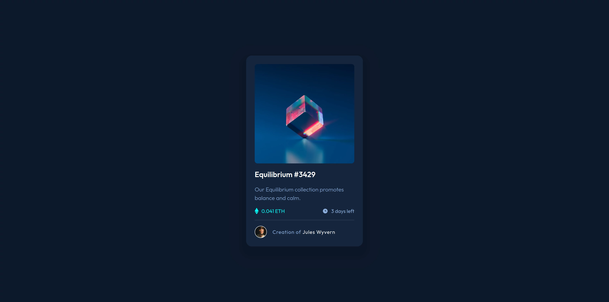

# Frontend Mentor - NFT preview card component solution

This is a solution to the [NFT preview card component challenge on Frontend Mentor](https://www.frontendmentor.io/challenges/nft-preview-card-component-SbdUL_w0U). 

:heavy_check_mark: [Live Solution URL](https://dmnk28.github.io/nft-preview/)

## Table of contents

- [The challenge](#the-challenge)
  - [Screenshot Challenge](#screenshot-challenge)
- [My process](#my-process)
- [What I learned](#what-i-learned)
- [Frontend Mentor Profile](#frontend-mentor-profile)

## The challenge

Users should be able to:

- View the optimal layout depending on their device's screen size
- See hover states for interactive elements

### Screenshot Challenge

## My process

Built with HTML & CSS (using SASS)

## What I learned

First time I had to make an image-overlay. But seems to work pretty well

## Frontend Mentor Profile:

[@Dmnk28](https://www.frontendmentor.io/profile/Dmnk28)